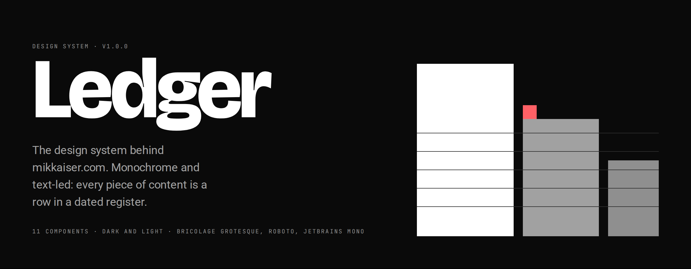
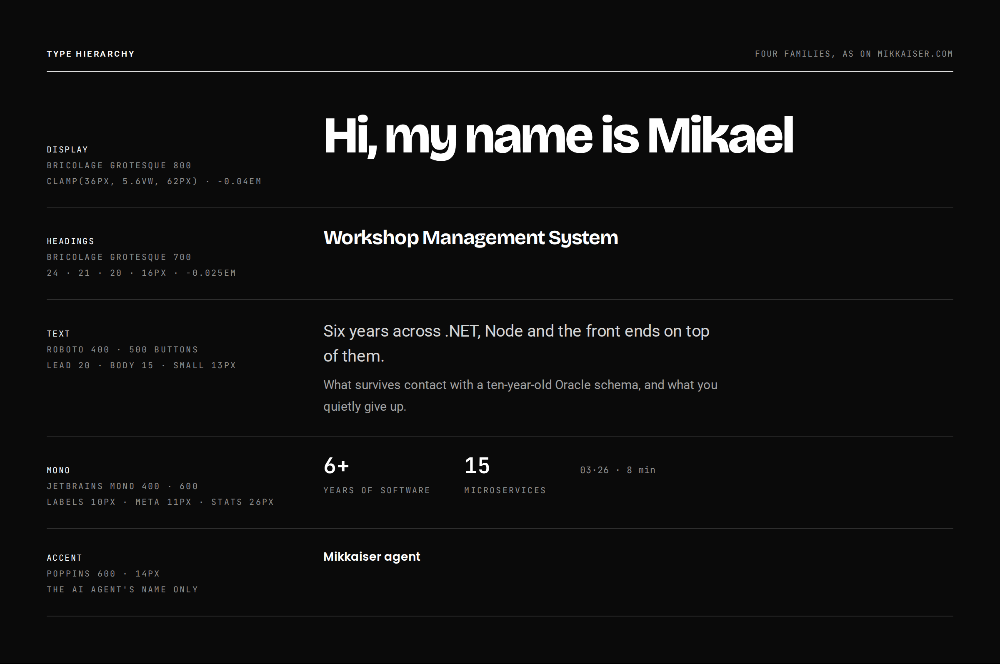
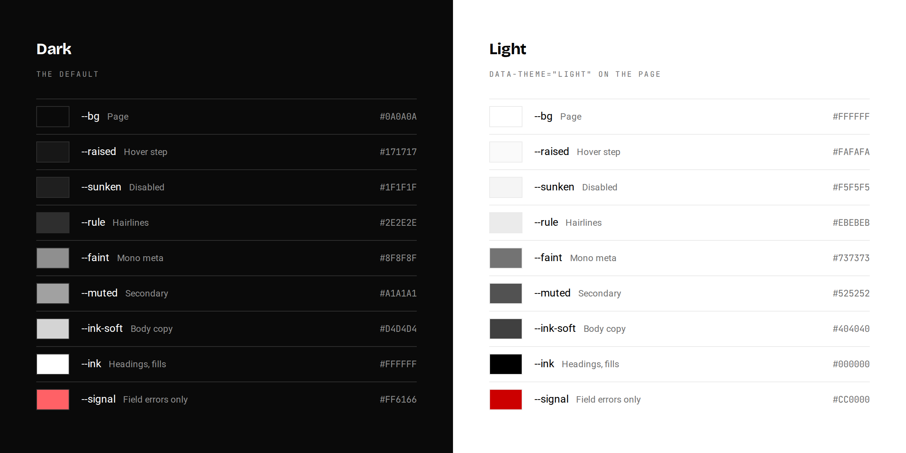
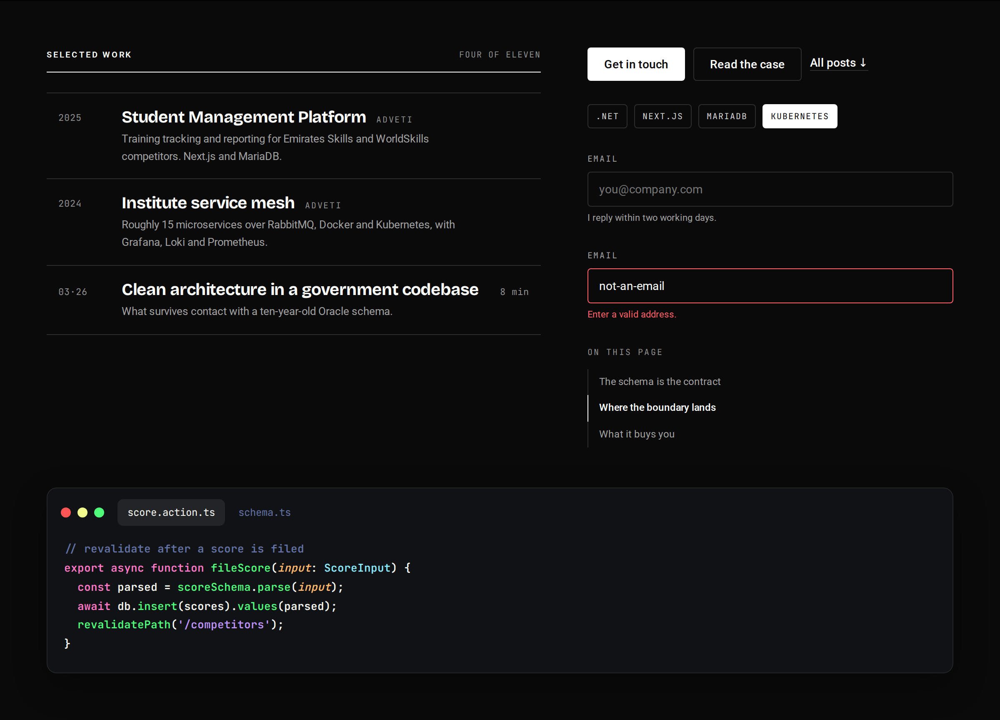
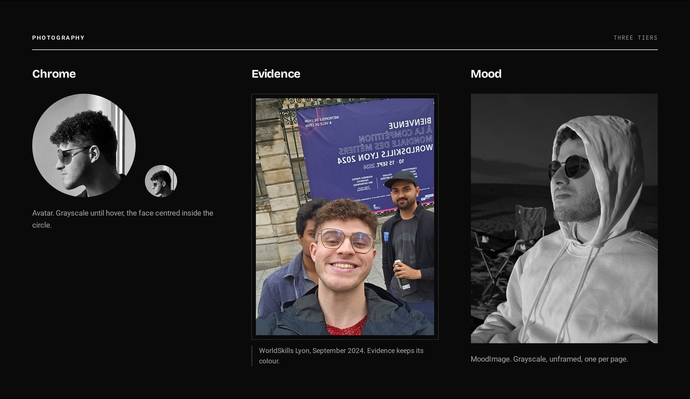

# Ledger

**Ledger** is the design system behind [mikkaiser.com](https://mikkaiser.com), the portfolio and blog of Mikael Ribeiro (Mikkaiser), a senior software developer in Abu Dhabi. It is monochrome and text-led. Every piece of content is a row in a dated register, and a sticky rail carries the name, the map and the contact.

It ships as 11 React components styled entirely with CSS custom properties: no provider, no theme object, no class vocabulary. The same system is synced to Claude Design, so the design agent there builds with these exact components.

[Brand book](../readme.md) · [Tokens](../tokens) · [Components](../components) · [Guideline cards](../guidelines)

## Type

Four families, in the hierarchy of mikkaiser.com. Bricolage Grotesque names things, Roboto is what you read, JetBrains Mono is anything countable.



| Tier | Family | Use |
| --- | --- | --- |
| Display | Bricolage Grotesque 800, `-0.04em` | Hero (up to 62px), closing statements (48px), page titles, footer brand |
| Headings | Bricolage Grotesque 700, `-0.025em` | Dialogs 24px, cards 21px, rows 20px, the name in the header 16px |
| Text | Roboto 400, buttons at 500 | Lead 20px, body 15px, small 13px, section eyebrows 10px caps |
| Mono | JetBrains Mono 400 and 600 | Labels, dates, stats, and every line of code |
| Accent | Poppins 600 | The AI agent's name label, nothing else |

## Colour

Strictly monochrome: ten neutrals and one signal. Hierarchy comes from weight, size and a single background step, never from hue. Dark is the default; put `data-theme="light"` on the page to invert it.



`--signal` exists for field errors only. Every text pair clears WCAG AA in both themes.

## Components



| Component | What it is for |
| --- | --- |
| [`SectionHead`](../components/core/SectionHead.prompt.md) | Opens every section. The only 1px ink rule in the system |
| [`EntryRow`](../components/content/EntryRow.prompt.md) | One item of work or writing, dated, in a hairline-divided set |
| [`Button`](../components/core/Button.prompt.md) | Primary ink fill, secondary outline, ghost underline |
| [`Tag`](../components/core/Tag.prompt.md) | Stack items, categories and filters. Mono, uppercase |
| [`Field`](../components/forms/Field.prompt.md) | Every text input, with its own label, helper and error line |
| [`TocList`](../components/navigation/TocList.prompt.md) | Table of contents for articles with three or more headings |
| [`CodeSnap`](../components/content/CodeSnap.prompt.md) and `Syn` | Every code block: Dracula colours, window chrome, never themed |
| [`Avatar`](../components/content/Avatar.prompt.md) | Portraits, grayscale until hover |
| [`Figure`](../components/content/Figure.prompt.md) and `MoodImage` | Evidence photos in colour with a caption, or one grayscale mood image per page |

## Photography

Photography is the one place Ledger meets colour, so the treatment depends on the job the image does.



## Rules that never bend

1. No em dashes in copy. Use a comma, a period, a colon, or "and".
2. No serif fonts, and nothing outside the four families.
3. Code is always `CodeSnap`: JetBrains Mono 600 with ligatures, Dracula, a dark card. It never takes the page theme.
4. No gradients, patterns, transparency, blur or shadows. Depth is one background step.
5. No icon set. Inline Unicode only: `↗` external, `↓` in-page, `·` between metadata.
6. Sentence case everywhere. Uppercase only inside `SectionHead`, `Tag` and mono labels.

The [brand book](../readme.md) has the full reasoning: voice, spacing, motion, layout and imagery.

## Using it

The package entry imports `styles.css` itself, so tokens and fonts arrive with the first component you import. React 18 is a peer dependency, and the components are plain JSX, so your bundler needs to compile this package (for example `transpilePackages` in Next.js).

```bash
npm install github:Mikkaiser/mikkaiser-design-system
```

```jsx
import { SectionHead, EntryRow, Button } from 'ledger-design-system';

export function SelectedWork() {
  return (
    <section>
      <SectionHead label="Selected work" meta="Four of eleven" />
      <div style={{ borderTop: 'var(--hairline) solid var(--rule)' }}>
        <EntryRow date="2025" kicker="ADVETI" title="Student Management Platform"
          summary="Training tracking and reporting for Emirates Skills competitors. Next.js and MariaDB." />
        <EntryRow date="03·26" duration="8 min" title="Clean architecture in a government codebase"
          summary="What survives contact with a ten-year-old Oracle schema." />
      </div>
      <Button variant="ghost" href="/work">All work ↓</Button>
    </section>
  );
}
```

Style your own layout with the tokens (`var(--bg)`, `var(--space-6)`, `var(--font-display)`), never with literal colours or sizes.

## Repository

| Path | What it holds |
| --- | --- |
| `styles.css` | The entry stylesheet: Google Fonts and every token file |
| `tokens/` | Colours, typography, spacing, code colours, motion, base resets |
| `components/` | The components, each with `.jsx`, `.d.ts` and a `.prompt.md` usage guide |
| `guidelines/` | Foundation specimen cards shown in Claude Design |
| `assets/` | Owner photography |
| `.design-sync/` | Config, notes and previews for syncing to Claude Design |
| `.github/readme-images/` | The page and script that render the images in this README |

To refresh the images after a change, run a Claude Design sync build (it produces `ds-bundle/`), then `node .github/readme-images/render.mjs`.
